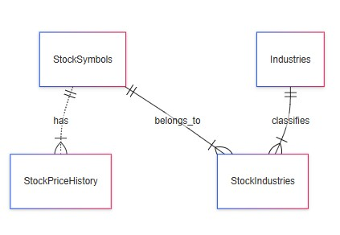

# Design Document

By Carlos Arranz

Video overview: https://youtu.be/jsBKVazEOj0?feature=shared

## Scope

The database for CS50 SQL includes all entities necessary to facilitate the process of store and retrieve historical prices and trading volumes of stocks of interest.  As such, included in the database's scope is:

* Companies, including the industry where they belong to and their symbols which are the unique identifiers.
* Historical stock data, including opening and closing prices, among others.

Out of scope include investor information, real-time data, news sentiment.

## Functional Requirements

This database will support:

* Filtering data by stock and date.
* Retrieve historical stock price and volume data.
* Identify days with unusual trading volume.
* Compare the price performance of different stocks.

Note that in this iteration, the system will not support to view financial news or sentiment analysis neither access real-time trading data.

## Representation

### Entities

The `StockSymbols` table includes:

* `stock_symbol`, which specifies the unique identifier for the stock as a `TEXT`. This column thus has the `PRIMARY KEY` constraint applied.

* `company_name`, which specifies the description/name of the company as `TEXT`, given `TEXT` is appropriate for name fields. NOT NULL constraint applies.

The `StockPriceHistory` table includes:

* `stock_symbol`, which specifies the identifier for the stock as a `TEXT`. This column thus is part of the composite `PRIMARY KEY` along with `trade_date`. There is ON DELETE RESTRICT constraint on the FOREIGN KEY referencing "StockSymbols" table to prevent the user to delete records from "StockSymbols" if there are still records in "StockPriceHistory" table associated with that stock.

* `trade_date`, which specifies the date of the transaction as `TEXT`, given `TEXT` is appropriate for dates in SQLITE. NOT NULL constraint applies.

* `open_price`, which specifies the opening price of the stock as `REAL` on a specific date, given `REAL` is appropriate for decimals in SQLITE.

* `high_price`, which specifies the highest price of the stock as `REAL` on a specific date, given `REAL` is appropriate for decimals in SQLITE.

* `low_price`, which specifies the lowest price of the stock as `REAL` on a specific date, given `REAL` is appropriate for decimals in SQLITE.

* `close_price`, which specifies the closing price of the stock as `REAL` on a specific date, given `REAL` is appropriate for decimals in SQLITE.

* `adjusted_close`, which specifies the closing price of the stock as `REAL` on a specific date, given `REAL` is appropriate for decimals in SQLITE.

* `volume`, which specifies the trading volume of the stock as `INTEGER` on a specific date.

The `industries` table includes:

* `industry_id`, which specifies the unique identifier to the industry as a `INTEGER`. This column thus has the `PRIMARY KEY` constraint applied along with  AUTOINCREMENT.

* `industry_name`, which specifies the name of the industry as `TEXT`, given `TEXT` is appropriate for name fields. NOT NULL UNIQUE constraints apply to ensure that every industry has a name and that no two industries have the exact same name.

The `StockIndustries` junction table includes:

* `stock_symbol`, which specifies the unique identifier for the stock as a `TEXT`. This column thus has a composite `PRIMARY KEY` constraint applied along with `industry_id`. There is ON DELETE RESTRICT constraint on the FOREIGN KEY referencing "StockSymbols" table to prevent the user to delete records from "StockSymbols" if if there are still records in "StockIndustries" associated with that stock.

* `industry_id`, which specifies the unique identifier to the industry as a `INTEGER`.
There is ON DELETE RESTRICT constraint on the FOREIGN KEY referencing "Industries" table to prevent the user to delete records from "Industries" table if there are still records in "StockIndustries" associated with that industry.

### Relationships

The below entity relationship diagram describes the relationships among the entities in the database.

As detailed by the diagram:

* One stock can have 0 or many historical price records associated with it. Each price record belongs to exactly one stock symbol. (one-to-many)

* One stock belongs to one or multiple industries while one industry can classifies one or mutliple stocks. (many-to-many)

## Optimizations

Per the typical queries in `queries.sql`, it is common for users of the database to access company information by filtering by the name of the company, retrieve historical stock prices by a specific date, or find information about industries by their industry name. For these reasons, indexes are created on the `company_name` column in the "StockSymbols" table, the `trade_date` column in the "StockPriceHistory" table, and the `industry_name` column in the "Industries" table to speed up data retrieval based on these frequently used criteria.

The last index created was to find all stocks belonging to one industry (very efficient) or the industries that classify one stock (less efficient)

## Limitations

The current schema is not tracking splits, dividends, or other corporate actions and also it has a limited scope of the companies information.
Moreover, it operates only with historical data and not live data.

## Acknowledgements

I would like to thank Luis Aguirre for his significant assistance regarding the finantial aspects of the stockmarket. His help was crutial in visualizing this project and laying the grounwork for my exploration on these topis.
